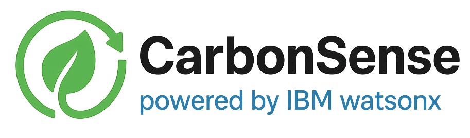
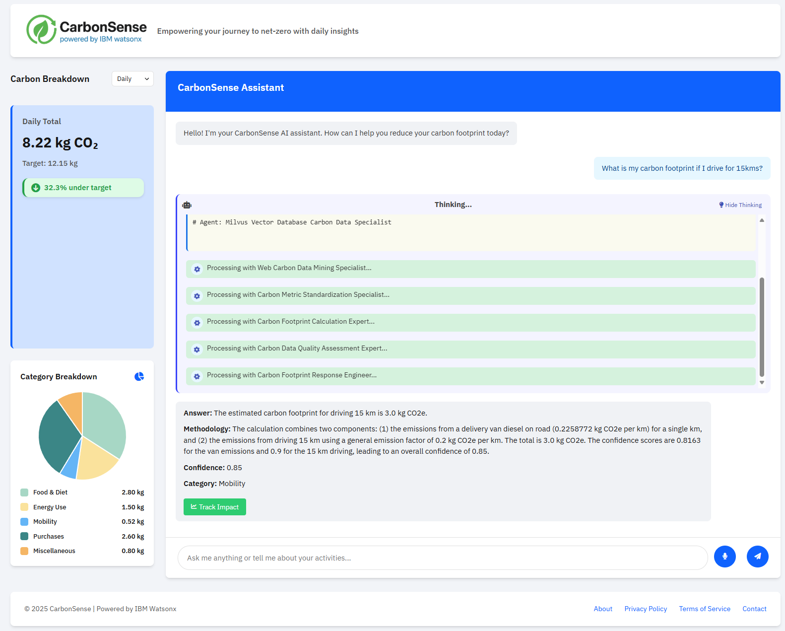

# CarbonSense powered by IBM Watsonx



A comprehensive system for carbon footprint data analysis powered by IBM watsonx.ai. This system processes, analyzes, and provides insights into carbon footprint data from various sources through an innovative multi-agent AI architecture.

## Table of Contents

- [Project Overview](#project-overview)
- [System Architecture](#system-architecture)
- [Agentic Pipeline](#agentic-pipeline)
- [Key Features](#key-features)
- [Prerequisites](#prerequisites)
- [Installation](#installation)
- [Directory Structure](#directory-structure)
- [Usage](#usage)
- [Troubleshooting](#troubleshooting)
- [Technical Documentation](#technical-documentation)

## Project Overview

CarbonSense is an AI-driven interactive platform designed to help individuals assess and reduce their carbon emissions. By leveraging Large Language Models (LLMs), Retrieval-Augmented Generation (RAG), and verified environmental datasets, this system provides real-time insights, personalized recommendations, and engaging sustainability tracking.

The platform addresses the challenge many individuals face in understanding their personal carbon footprint and discovering practical, personalized ways to reduce it. Using advanced AI technologies from IBM Watsonx, CarbonSense makes sustainable choices accessible and actionable.



## System Architecture

CarbonSense employs a sophisticated architecture combining multiple IBM Watsonx services to deliver accurate carbon footprint analysis:


The system consists of two main components:

### Frontend / UI (FastAPI)

- Dashboard for visualizing carbon usage
- Text and voice input interfaces
- IBM Speech-to-Text conversion for voice queries
- Prompt building and response formatting

### Backend

- AI Foundation Models from IBM WatsonX
- Milvus Vector Database for embedding storage
- IBM Cloud Object Storage for data management
- IBM Watson Discovery for web search
- Agentic processing pipeline for query handling

## Agentic Pipeline

CarbonSense uses a modular, multi-agent pipeline to process sustainability-related queries. This approach allows for specialized handling of different query types and improved accuracy in responses.

.png)

The pipeline consists of five key layers:

1. **Query Understanding Layer**

   - Query Classifier: Determines query intent and type
   - Entity Extractor: Identifies products, quantities, and units
   - Unit Normalizer: Standardizes measurements for consistent analysis
2. **Retrieval & Research Layer**

   - Milvus Researcher: Searches vector database for relevant carbon data
   - Watson Discovery Researcher: Analyzes structured knowledge base
   - Serper Web Search Researcher: Retrieves up-to-date information from the web
3. **Carbon Estimation & Synthesis**

   - Harmoniser: Combines data from multiple sources
   - Carbon Estimator: Calculates carbon footprint values
   - Metric Ranker: Prioritizes most reliable metrics
4. **Intent-Specific Processing**

   - Comparison Formatter: Structures comparative analyses
   - Recommendation Agent: Generates sustainability suggestions
   - Explanation Agent: Provides educational content
5. **Response Generation**

   - Answer Formatter: Creates clear, well-structured responses

## Key Features

- **Automated Carbon Footprint Calculation**: Estimates emissions for various activities and products using verified datasets
- **Voice & Text Query Support**: Interact through natural language text or voice commands
- **Multi-Agent AI System**: Uses specialized AI agents for accurate, contextual responses
- **Web-Enhanced Retrieval**: Combines local data with real-time web information
- **Comparison Analysis**: Compare carbon footprints of different products or activities
- **Visual Dashboard**: Track carbon usage across different categories
- **Recommendation Engine**: Get personalized suggestions for reducing carbon footprint

## Prerequisites

### 1. System Requirements

- Python 3.11 or higher
- 8GB RAM minimum (16GB recommended)
- 20GB free disk space
- Internet connection for API access
- Windows operating system (for Windows-specific setup)

### 2. Required Services

- IBM Cloud Account
- Watsonx.ai access
- Milvus instance
- Cloud Object Storage (COS)
- Watson Discovery service
- Watson Speech-to-Text service (for voice queries)

## Installation

### 1. Clone the Repository

```bash
git clone https://github.com/your-org/CarbonSense-powered-by-IBM-Watsonx.git
cd CarbonSense-powered-by-IBM-Watsonx
```

### 2. Create and Activate Virtual Environment

```powershell
# Create virtual environment
python -m venv carbon_env

# Activate virtual environment
.\carbon_env\Scripts\activate
```

### 3. Install Dependencies

```powershell
# Install the package and its dependencies
pip install -e .
```

This will install all required dependencies listed in setup.py, including:

- python-dotenv
- ibm-watsonx-ai
- ibm-cos-sdk
- pymilvus
- python-docx
- pandas, numpy, and tqdm
- crewai (for multi-agent workflows)
- fastapi and uvicorn (for the web interface)
- litellm (for WatsonX integration with CrewAI)

### 4. Environment Configuration

Create a `.env` file in the root directory with your credentials:

```env
# IBM Cloud Object Storage
COS_API_KEY=your_cos_api_key
COS_INSTANCE_ID=your_cos_instance_id
COS_ENDPOINT=your_cos_endpoint
BUCKET_NAME=your_bucket_name

# IBM Watsonx
WATSON_STUDIO_PROJECT_ID=your_project_id
WATSONX_API_KEY=your_watsonx_api_key
WATSONX_URL=your_watsonx_url

# Milvus
MILVUS_GRPC_HOST=your_milvus_host
MILVUS_GRPC_PORT=your_milvus_port
MILVUS_CERT_PATH=path_to_milvus_cert

# Watson Discovery
WATSON_DISCOVERY_API_KEY=your_discovery_api_key
WATSON_DISCOVERY_URL=your_discovery_url
WATSON_DISCOVERY_PROJECT_ID=your_discovery_project_id

# Watson Speech-to-Text
IBM_STT_API_KEY=your_stt_api_key
IBM_STT_URL=your_stt_url
```

### 5. Fetch Milvus Certificates

Before using the system, you need to fetch the required Milvus certificates:

```powershell
# Fetch and install Milvus certificates
python -m src.carbonsense.main --mode fetch_certs
```

This command will:

- Create a backup of any existing certificate
- Fetch the new certificate from the Milvus server
- Save it in the root directory as `milvus-grpc.crt`
- Update the environment variables

## Directory Structure

The system uses the following structure:

```
.
├── Data_processed/          # Processed data files
│   ├── electricity/         # Electricity production data
│   ├── industry/            # Industry-specific data
│   ├── metadata/            # Supporting information
│   └── regional/            # Region-specific data
├── logs/                    # Logs for agent thoughts and processing steps
│   ├── communication/       # Agent communication logs
│   ├── thoughts/            # Agent reasoning logs
│   └── visualizations/      # Data visualization logs
├── Embeddings/              # Local embedding storage
│   ├── Embeddings_30m/      # 30M model embeddings
│   ├── Embeddings_125m/     # 125M model embeddings
│   └── Embeddings_granite/  # Granite model embeddings
├── images/                  # Project images and diagrams
├── scripts/                 # Utility scripts
│   ├── preprocess_dataset.py  # Data preprocessing script
│   ├── setup.ps1            # Setup automation script
│   └── process_industry_data.py # Industry data processor
├── src/                     # Source code
│   └── carbonsense/         # Main package
│       ├── core/            # Core functionality
│       │   ├── carbon_agent.py  # Standard agent implementation
│       │   ├── carbon_flow.py   # Process flow manager
│       │   ├── crew_agent.py    # CrewAI orchestration
│       │   ├── embedding_generator.py # Embedding creation
│       │   ├── rag_generator.py # RAG implementation
│       │   ├── yaml_manager.py  # YAML config manager
│       │   ├── config/      # YAML configuration files
│       │   │   ├── agents.yaml  # Agent definitions
│       │   │   ├── tasks.yaml   # Task workflow definitions
│       │   │   ├── prompts.yaml # System prompts
│       │   │   └── common_schema.yaml # Common schema definitions
│       │   └── tools/       # Agent tools
│       ├── services/        # Service integrations
│       │   ├── cache_service.py # Caching functionality
│       │   ├── cos_service.py   # Cloud Object Storage
│       │   ├── discovery_service.py # Watson Discovery
│       │   ├── embedding_storage_service.py # Vector storage
│       │   ├── milvus_service.py  # Milvus integration
│       │   ├── watsonx_service.py # WatsonX AI
│       │   └── litellm_watsonx_service.py # WatsonX via LiteLLM
│       ├── utils/           # Utility functions
│       ├── config/          # Configuration management
│       ├── web/             # Web interface
│       │   ├── app.py       # FastAPI application
│       │   ├── run_server.py # Server runner
│       │   ├── templates/   # HTML templates
│       │   └── static/      # CSS, JS, and images
│       └── main.py          # Command-line interface
├── .env                     # Environment variables
└── milvus-grpc.crt          # Milvus certificate
```

## Usage

### 1. Web Interface

Run the web server to access the dashboard interface:

```powershell
python -m src.carbonsense.web.run_server
```

Then open your browser to http://localhost:8000 to access the CarbonSense dashboard.

### 2. Generating Embeddings

#### Process All Files

```powershell
# Use default model (30M)
python -m src.carbonsense.main --mode generate

# Use specific model
python -m src.carbonsense.main --mode generate --model granite

# Process specific files
python -m src.carbonsense.main --mode generate --files Data_processed/regional/europe_consolidated.xlsx Data_processed/electricity/electricity_USA.xlsx
```

Available options:

- `--mode generate`: Required. Specifies the generation mode
- `--model`: Optional. Specify which model to use:
  - `30m`: ibm/slate-30m-english-rtrvr-v2 (384 dimensions)
  - `125m`: ibm/slate-125m-english-rtrvr-v2 (768 dimensions)
  - `granite`: ibm/granite-embedding-278m-multilingual (768 dimensions)
- `--files`: Optional. List of specific files to process

### 3. Verification

```powershell
# Verify all model collections
python -m src.carbonsense.main --mode verify

# Verify specific model
python -m src.carbonsense.main --mode verify --model granite
```

### 4. Querying Data

#### Text Queries

```powershell
# Standard RAG-based agent
python -m src.carbonsense.main --mode rag_agent --query "What is the carbon footprint of 10 paper napkins?"

# Advanced CrewAI agent
python -m src.carbonsense.main --mode crew_agent --query "Compare the carbon footprint of paper vs plastic bags"

# Flow-based agent (alternative implementation)
python -m src.carbonsense.main --mode flow_agent --query "What is the carbon impact of flying from New York to London?"
```

#### Voice Queries

```powershell
# Standard voice query (uses standard agent)
python -m src.carbonsense.main --mode stt_query --record_duration 15

# Voice query with CrewAI multi-agent system (advanced)
python -m src.carbonsense.main --mode stt_crew_agent --record_duration 15 --show_context --debug

# Voice query with flow-based agent
python -m src.carbonsense.main --mode stt_flow_agent --record_duration 15 --debug
```

#### Additional Options

- `--mode`: Choose between `rag_agent`, `crew_agent`, `flow_agent`, `stt_query`, `stt_crew_agent`, or `stt_flow_agent`
- `--query`: Your question about carbon footprint (required for text queries)
- `--show_context`: Shows the sources or agents used to generate the answer
- `--model`: Specify which model to use (30m, 125m, or granite)
- `--record_duration`: Duration of recording for voice input (seconds)
- `--debug`: Enable debug mode for detailed agent interactions
- `--no_cache`: Disable caching of query results
- `--sequential`: Use sequential process instead of hierarchical
- `--store_thoughts`: Store agent thoughts and reasoning in log files
- `--input_device`: Specify audio input device index for voice queries

### 5. System Maintenance

```powershell
# Clean up temporary files and caches
python -m src.carbonsense.main --mode cleanup
```

## Troubleshooting

### 1. Common Issues

#### API Authentication

- Verify API keys in .env file
- Check service URLs
- Ensure proper permissions

#### Audio Recording Issues

- Check microphone permissions
- Test with `--input_device` to select a specific microphone
- Verify Speech-to-Text credentials

#### Certificate Issues

- Run `fetch_certs` command to update certificates
- Verify certificate paths in .env file
- Check certificate permissions

## Technical Documentation

For more detailed information about the system, please refer to:

- [Implementation Details](IMPLEMENTATION.md) - Technical implementation details and configurations
- [System Architecture](ARCHITECTURE.md) - System design and component interactions
- [Agentic Pipeline](agentic_pipeline.md) - Details about the multi-agent workflow
- [Dataset Column Description](Dataset_Column_Description.md) - Information about the data structure
